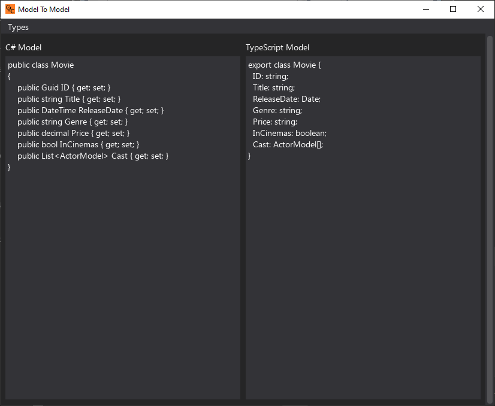
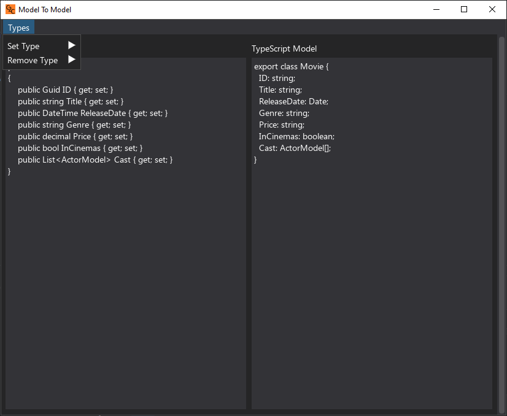

# C-ModelToTsModel
A simple tool to convert C# Models into TypeScript Models.
Using [DearPyGui](https://github.com/hoffstadt/DearPyGui) for the gui.

Example:

You can also delete, edit and add how it handles different types. Using the "Types" menu item.

